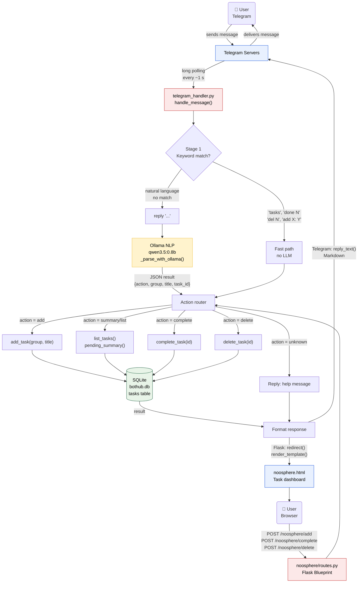
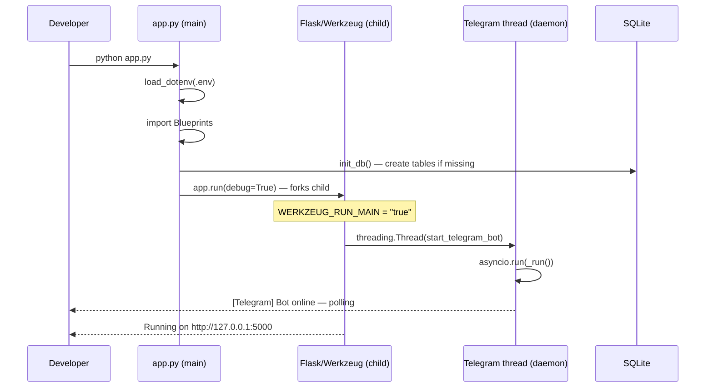
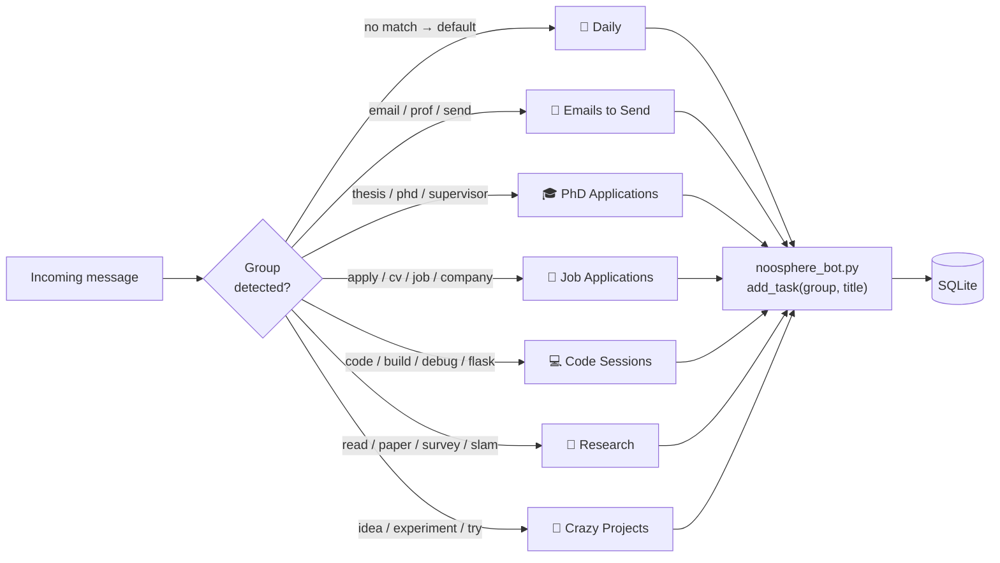
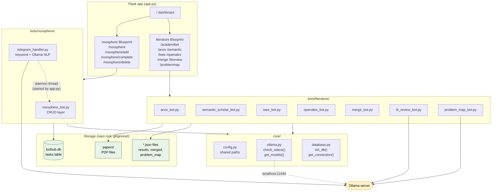

# NoosphereBot — Pipeline Schema

> Full algorithm from user input to database and back.
> GitHub renders Mermaid diagrams natively — view this file on GitHub to see the visual.

---

## Full Message Pipeline

---

## Startup Sequence

---

## Task Groups & Routing

---

## BotHub Platform Architecture

